</img>

<h1 align="center">HERB Monitoring</h1>

Click [here](https://natte2110.github.io/herb-monitoring/) to view the live project on GitHub Pages.

This is a project for the Code Institute Milestone Project 2. It is a website used to enable users to monitor frequently updated APIs containing geospatial information.

This will contain:
-   Weather Monitoring
-   Flood Alerts
-   Traffic Data

<h2 align="center">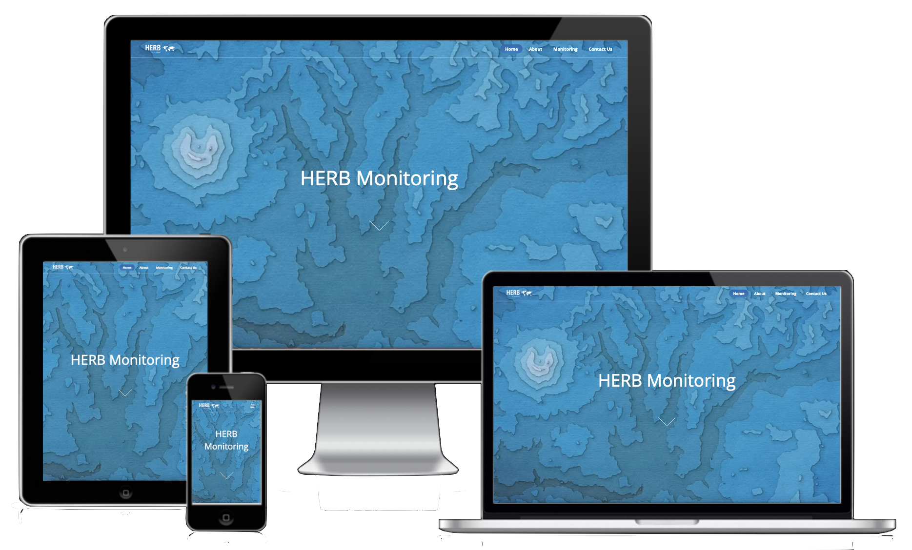</h2>

# User Experience (UX)

## User Stories

-    ### Goals For A First-Time Visitor:

        1. As A First Time Visitor - I want to be able to understand the main purpose of the site, and find out useful information regarding the business.
        2. As A First Time Visitor - I want to be able to view an intuitive layout and navigation to easily find the page I require.
        3. As A First Time Visitor - I want to be able to interact with the maps on the page to achieve my desired purpose.

-    ### Goals For A Returning Visitor:

        1. As A Returning Visitor - I want to be able to see any updates to the information on the monitoring maps.
        2. As A Returning Visitor - I want to be able to view a page containing contact details where I can ask for support or pose general queries.
        3. As A Returning Visitor - I want to be able to query the monitoring data to gain a better understanding of what it represents.

-    ### Goals For A Frequent Visitor:

        1. As A Frequent Visitor - I want to be able to view updated information to see if anything is pertinent to me.
        2. As A Frequent Visitor - I want to be able to use a location feature to find a specific area of the country, preferably my own location.
        3. As A Frequent Visitor - I want to be able to check a specific traffic incident to see if it will affect me.

## Design

-   ### Colour Scheme

    -   The main colour scheme will be an off-blue colour with an overall dark feel to the site. White text will be used atop this dark background to ensure clear visibility of all text across all pages.
    - This colour scheme will provide a professional feel to the website as well as being easily accessible to all users.

-   ### Typography

    -   The main font used within the websites design will be Open Sans, with a fall-back font of Sans-Serif if the Open Sans font could not be loaded. The Open Sans font gives off a professional first impression.

-   ### Imagery

    -   The home page will be fitted with a fixed, scrollable background image that will have a dynamic blur effect applied as the user scrolls.
    -   Imagery will also be available in [popups](https://developers.arcgis.com/javascript/latest/api-reference/esri-widgets-Popup.html) contained within the information displayed on the mapping pages.

## Wireframes

Click on the links below to access the wireframes created to plan and design this website.

-   [Desktop Home Page Wireframe](assets/media/desktop-wireframe01.png)

-   [Mobile Home Page Wireframe](assets/media/mobile-wireframe01.png)

## Features

-   ### Responsive

    -   The website will be responsive on all devices, with CSS media queries to change size and position of elements on different screen sizes.

-   ### Interactive

    -   The website will incorporate interactivity by allowing the user to complete actions within the monitoring map faces.

-   ### Current

    -   The website will pull up-to-date data from monitoring APIs and display them accordingly. This will ensure that any new features will be dynamically loaded and added to the maps.

# Technologies Used

## Languages Used

-   [HTML5](https://en.wikipedia.org/wiki/HTML5)
-   [CSS](https://en.wikipedia.org/wiki/Cascading_Style_Sheets)
-   [JavaScript](https://en.wikipedia.org/wiki/JavaScript)

## External Frameworks, Programmes, Libraries and API's Used

1. [Google Fonts:](https://fonts.google.com/)
    - Google fonts were used in order to import the Open Sans font used in the design of the website. The link to the google font was placed at the top of the overarching CSS File.
2. [Font Awesome:](https://fontawesome.com/)
    - Font Awesome was used to add icons to certain elements in order to provide more information about them, such as a 'Telephone' Icon to preface the company phone number.
3. [Bootstrap 4.1.3:](https://getbootstrap.com/docs/4.1/getting-started/introduction/)
    - Bootstrap was utilised in order to create the main structure of the page more easily, by using the ready-made components to create a responsive design/layout.
4. [jQuery:](https://jquery.com/)
    - jQuery worked in accordance with Bootstrap to add additional interaction and responsivity to the Navbar and other elements.
5. [Git](https://git-scm.com/)
    - Git was used for version control by using the terminal to add and commit files and messages when changes were made in order to keep a documented track of the development process.
6. [GitHub:](https://github.com/)
    - GitHub was used in order to store the files pushed from the terminal using git. It was also used to host the final project using GitHub Pages.
7. [Balsamiq:](https://balsamiq.com/)
    - Balsamiq was used to create the wireframes during the initial design process.
8. [GIMP:](https://www.gimp.org/)
    - GIMP was used to create the websites logos that can be seen on each page.
9. [ArcGIS Maps SDK for JavaScript:](https://developers.arcgis.com/javascript/latest/)
    - This was used in order to create the maps and enable the visualisation of the geospatial data pulled from external API's
    - It also provides added interactivity through the use of widgets that enable the user to have an impact on the information they see.
10. [Environment Agency Real Time flood-monitoring API:](https://environment.data.gov.uk/flood-monitoring/doc/reference)
    - This Flood Monitoring API was used to gather geospatial locations and related attributes from flood monitoring stations across the UK.
    - This data was then used to plot the points on a map to provide a visual representation of the fetched information.
11. [Bing Maps - Traffic Incidents API:](https://learn.microsoft.com/en-us/bingmaps/rest-services/traffic/)
    - The Bing Maps Traffic Incidents API was used to receive data on all traffic incidents reported in a specific area.
    - This was later used in conjuction with the ArcGIS Maps SDK for JavaScript to provide a visual mapping representation of these incidents, allowing the user to interact with said data and attain more information by clicking on specific incidents if they wished to.
12. [Cloud Convert:](https://cloudconvert.com/)
    - Cloud convert was a web based image conversion tool used to convert .jpg and .png images to a more suitable .webp file type.
    - The use of this vastly reduced the file size of the images made for much quicker loading times on each page, and thus a more pleasant experience for a user.
13. [Jest](https://jestjs.io/)
    - Jest is a testing framework used for Test Driven Development of JavaScript. It was used in this project to ensure that certain functions provided the correct outputs before their deployment.

## Testing

To test the project, the W3C Markup and CSS Validators were used to ensure no syntax errors were present in the final code.

The JSLint Validator was also used in order to verify the minimal JavaScript Code used.

-   [W3C Markup Validator](https://jigsaw.w3.org/css-validator/#validate_by_input) - [Results](assets/media/htmlvalidator-result.png)
-   [W3C CSS Validator](https://jigsaw.w3.org/css-validator/#validate_by_input) - [Results](assets/media/cssvalidator-result.png)
-   [JSHint JavaScript Validator](https://jshint.com/) - [style.js](assets/media/jsvalidator-result.png) [monitoring.js](assets/media/jsvalidator-result02.png)

### Behaviour Driven Development (Manual Testing)

This form is development focuses on what is expected from a piece of software when the user interacts with it in a certain way. This could be anything from scrolling on the page to clicking a button.

BDD is also classed as a 'user-centric' form of development, and as such I utilised this to test the users experience whilst using the website. This type of testing was suitable for user experience as you cannot judge how a user would feel using the website just by values and attributes of the elements displayed.

The ways in which this form of testing was implemented are:

-   <b>Testing responsiveness of the website elements</b> - Using the Chrome Developer tools, the screensize was dynamically changed within the "Device Toolbar" to ensure that elements on the page were correctly sized, and all required content was visible at all scales.

    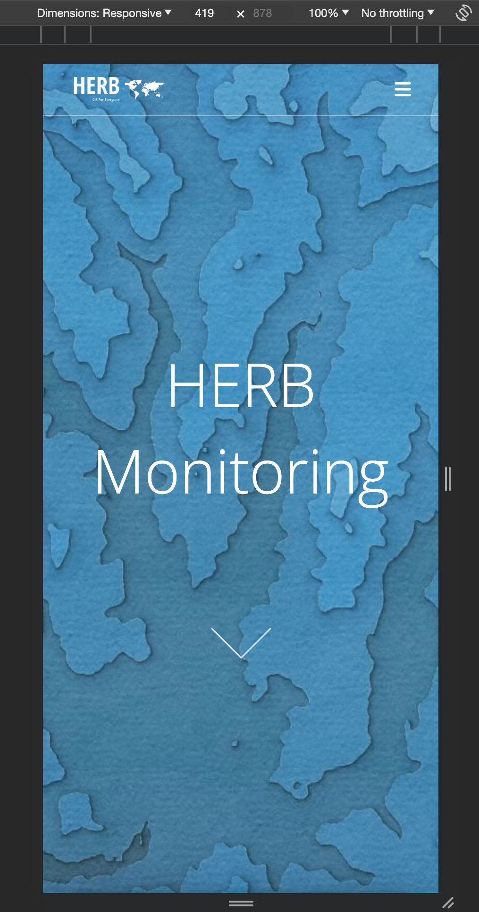
    

- <b>Validators</b> - by passing the link to the website through various validators (As shown above), each file in the project was tested for errors and to view any areas that could be improved.

- <b>Testing across browsers and devices</b> - The site itself was tested across various devices and different browsers on each. This style of testing was conducted to ensure seamless access across a variety of possible connected devices.
    - <b>Devices</b>
        -   MacBook Pro (MacOS)
        -   Windows 11 Laptop
        -   iPhone 12 (iOS)
        -   Raspberry Pi (Ubuntu 22.04)
    - <b>Broswers</b>
        -   Google Chrome
        -   AVG Secure Browser
        -   Chromium (Raspberry Pi)
        -   Safari

- <b>Page Speed Insights</b> - This is a tool that 'scores' a website based on it's proficiency in 4 categories. This was used as a manual testing tool to help gain an insight to the websites usability and where it can be improved.

    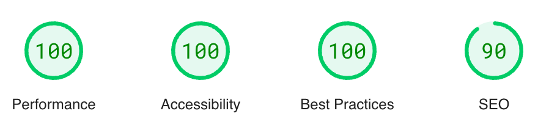

#### Known Issues

The development phase was mainly free of any major issues, however, once the project was deployed on GitHub Pages, one of the monitoring maps was unable to be loaded.

This was due to the API link starting with a 'http' instead of a 'https'. This caused GitHub Pages to restrict the fetch API from accessing this information, and as a result that specific portion of the displayable maps had to be removed.

    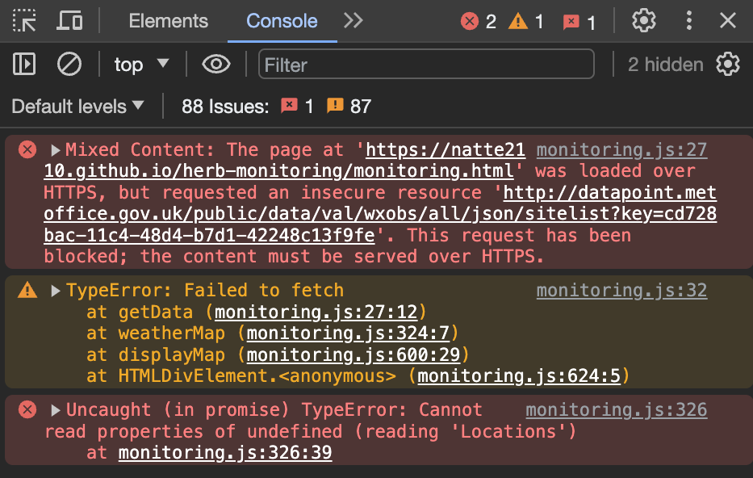

Aside from the aforementioned issue, no other major errors were present.

### Test Driven Development (Automatic Testing)

Test Driven Development focuses on a set structure whist creating usable functions:

1.  <b>Create a Failing Test</b> - Before adding any functionality to a function, you should first create a test detailing what exactly you want the outcome to be. This test, of course will fail as the code required to make it pass is not yet in place.
2.  <b>Make the test pass</b> - After the failing test has been written, the simplest process is written in the original function in order to make the previously created test pass.
3. <b>Refactor</b> - This stage refers to the optimisation of the code written to pass the previous test. This could be improving the speed or completely changing the way the process occurs.

This order of TDD is repeated continuously for each function to be tested. This ensures that all possible outcomes have been covered to ensure the code has a very minimal, if not non-existent chance of failing.

#### Implementation

This project utilised a form of testing using a JavaScript Framework called Jest. Jest allowed the testing of certain functions and their outputs before they were deployed on to each page.

Please click [here](./assets/js/tests/style.test.js) to view the testing file used for testing [style.js](./assets/js/style.js).

    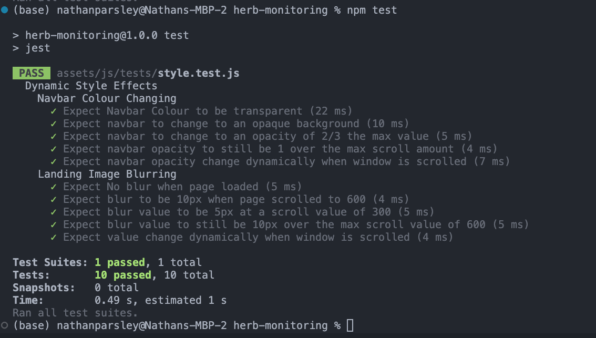

This testing framework was run in a Node.js environment, allowing the JavaScript files to be executed and tested completely irrespective of a web based environment.

### Testing User Stories from User Experience (UX) Section

-    #### Goals For A First-Time Visitor:

        1. As A First Time Visitor - I want to be able to understand the main purpose of the site, and find out useful information regarding the business.

            -   Upon visiting the initial 'Home' page, the user is greeted by a large map-like image, with the title of 'HERB Monitoring'. This can immediately be perceived as a form of map/monitoring system which is the main purpose of the site.

            

                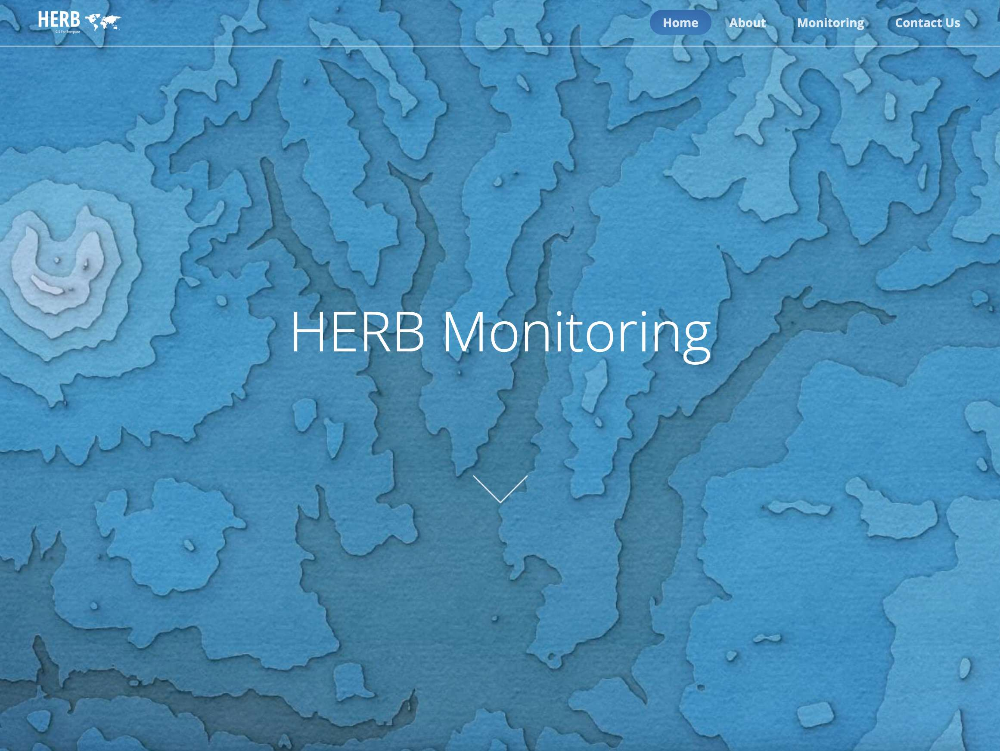
            

            -   The user is also greeted with a moving scroll indicator which intices a user to scroll down. Upon doing so, they are met with more information regarding the website with suitable images that convey what they can expect to see.

            

                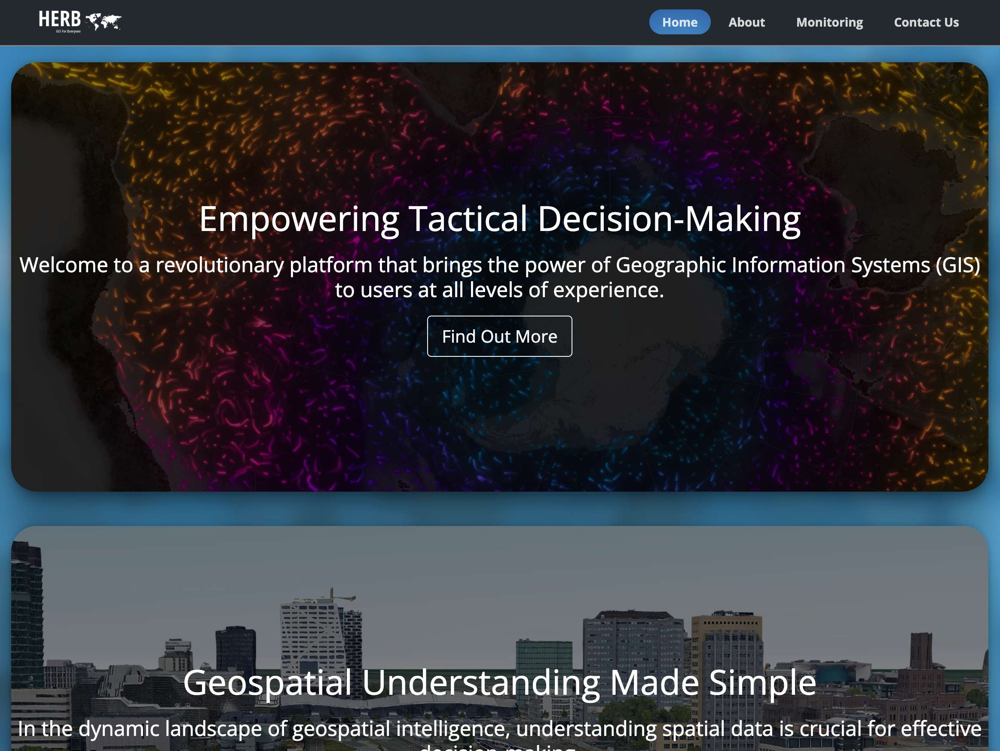
            

        2. As A First Time Visitor - I want to be able to view an intuitive layout and navigation to easily find the page I require.

            -   Each page contains a clean navigation bar at the top which turns into a expandable menu section on smaller screens.

            

                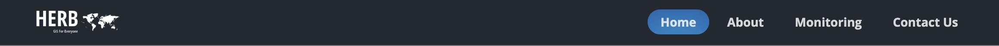
                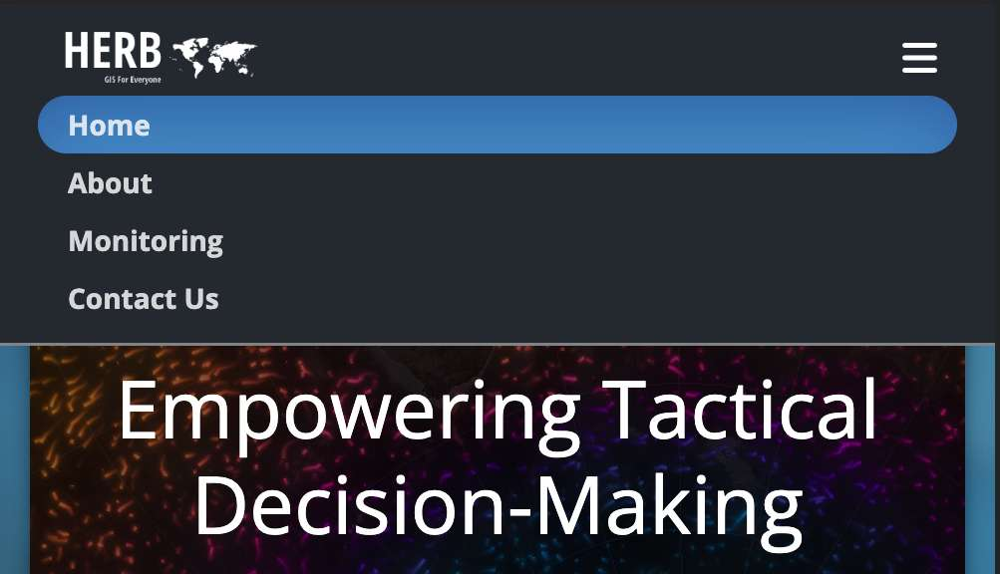
            

        3. As A First Time Visitor - I want to be able to interact with the maps on the page to achieve my desired purpose.

            -   On each interactive map, a user can click on features, change the data on the map and view more information on each section.

            

                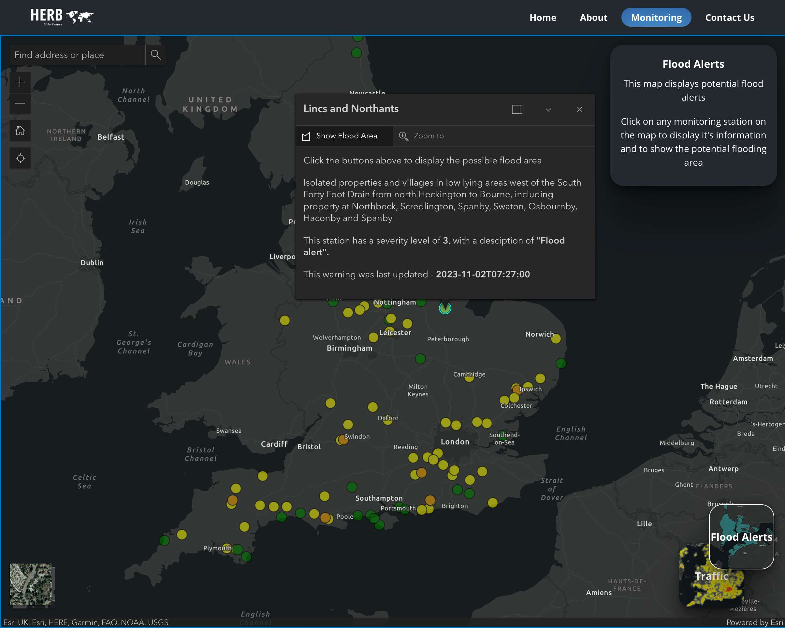
                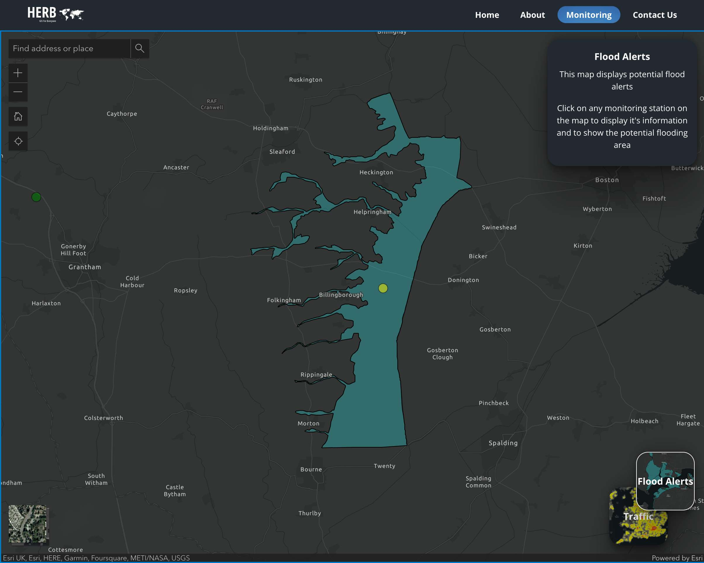
            

-    #### Goals For A Returning Visitor:

        1. As A Returning Visitor - I want to be able to see any updates to the information on the monitoring maps.

            -   The data for the maps is fetched every time that it is loaded, this ensures that each time a user visits the page, they are able to view completely up-to-date information every time. This is shown in the screenshot below, where the Fetch API returns the data each time the floodMap is loaded.

            

                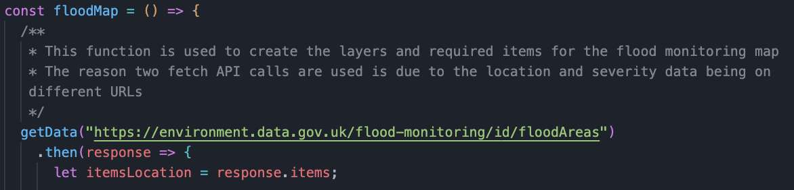
            

        2. As A Returning Visitor - I want to be able to view a page containing contact details where I can ask for support or pose general queries.

            -   Along the navigation bar is a link to a 'Contact Us' Page. (This link is also seen in the footer sitemap)
            -   On said page is the companies contact information, along with a form which would be used to send an email automatically to the companies enquiry inbox.

            

                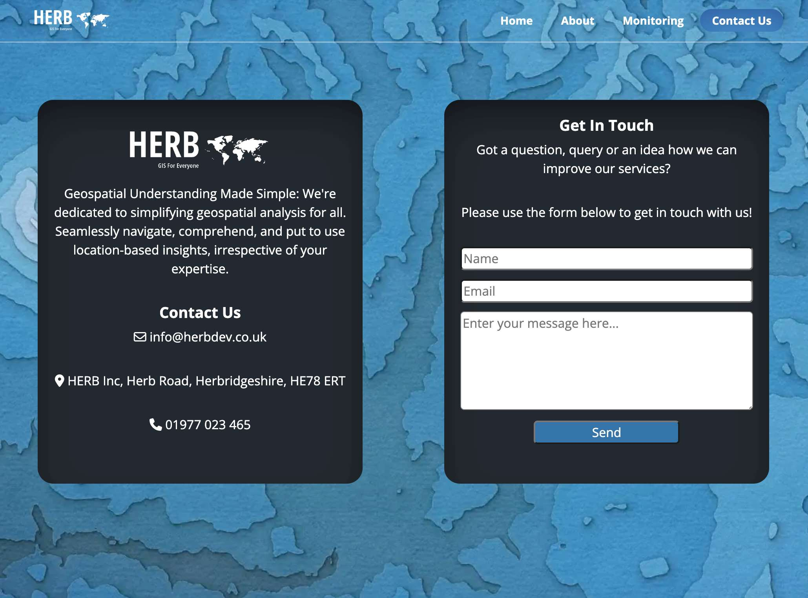
            

        3. As A Returning Visitor - I want to be able to query the monitoring data to gain a better understanding of what it represents.

            -   Each point on the maps can be interacted with. When done so, more information is available within a popup window above the point.

            

                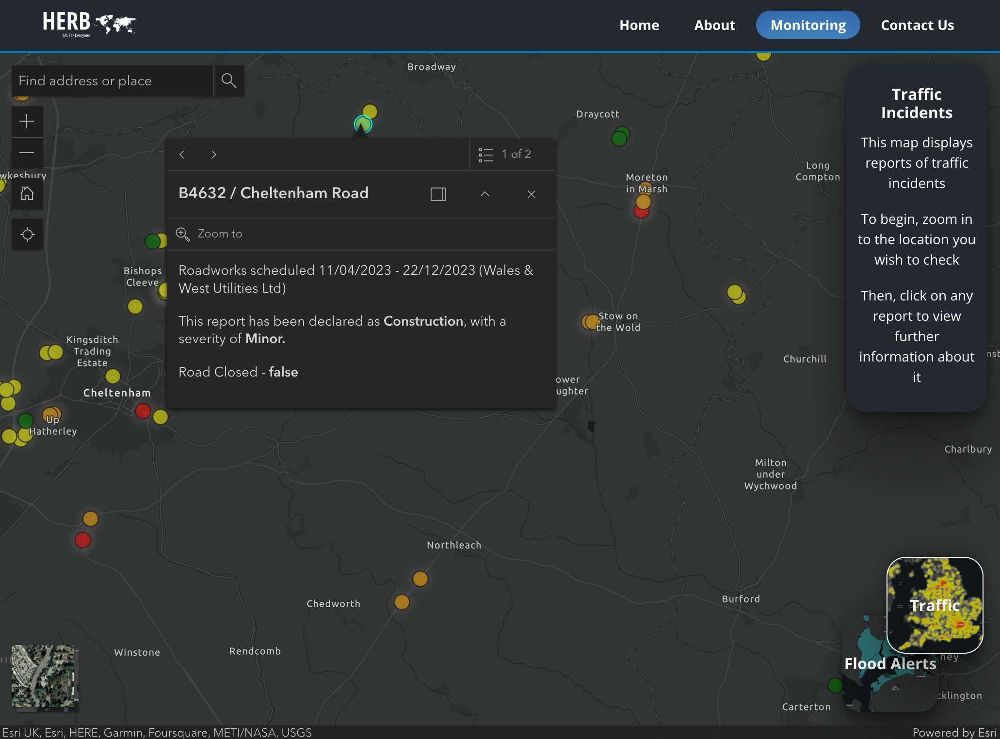
            

-    #### Goals For A Frequent Visitor:

        1. As A Frequent Visitor - I want to be able to view updated information to see if anything is pertinent to me.

            -   As previously mentioned, the data is gathered each time the map is loaded. Dates are also available in the popups to show a user the time period it effects.
            
            

                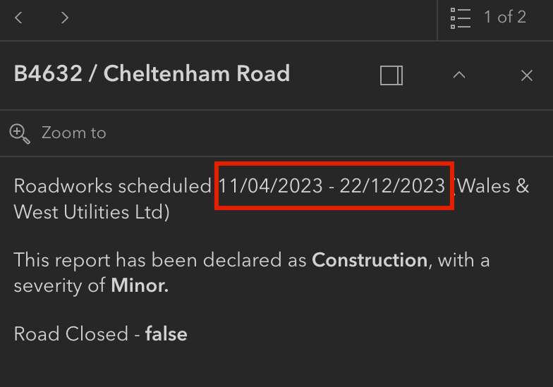
            

        2. As A Frequent Visitor - I want to be able to use a location feature to find a specific area of the country, preferably my own location.

            - A couple of widgets are available on the map face which can be used for locating the user on the map, or searching for a specific area. This allows a user to find information in their area or check a specific portion of the map.

            

                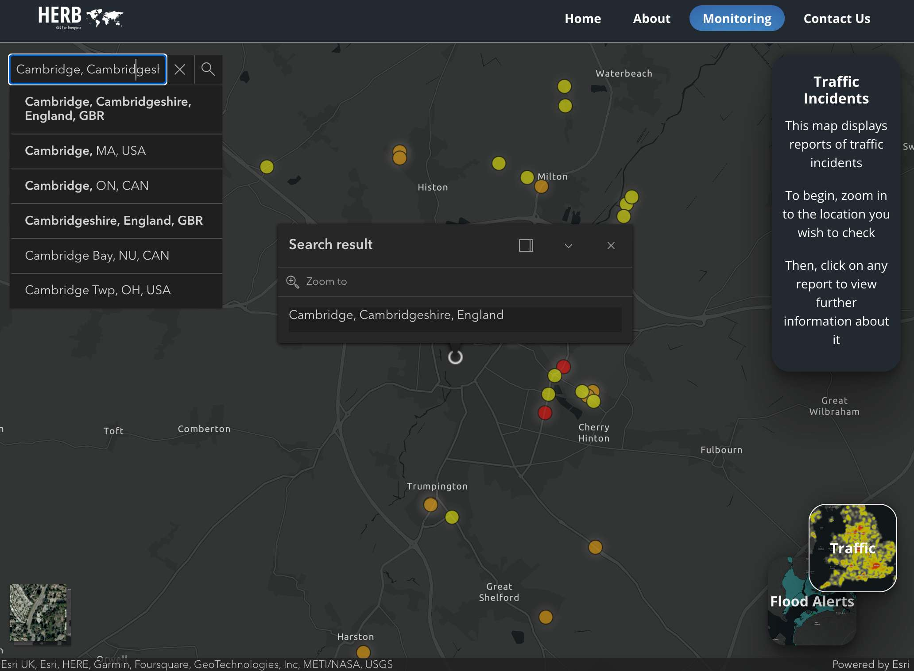
                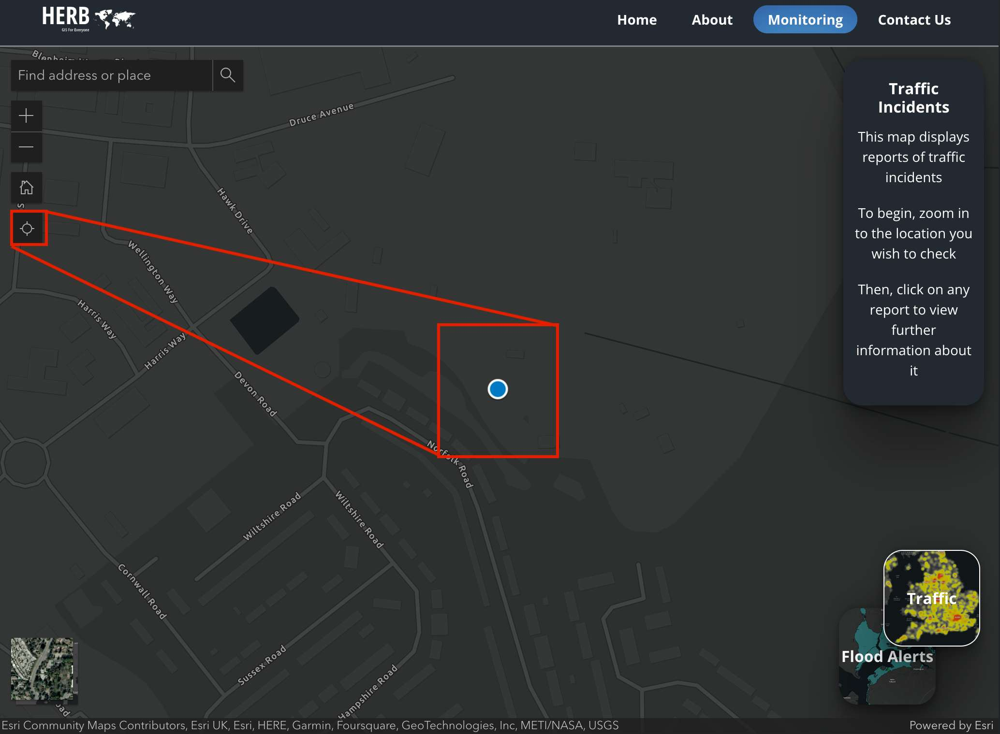
            

        3. As A Frequent Visitor - I want to be able to check a specific traffic incident to see if it will affect me.

            - On the traffic map, there is more information inside a popup for each incident. This contains information like a description, severity and what the incident is. This, in conjunction with the search widget allows a user to check a specific location they are interested in and see if a traffic incident will affect them.

            

                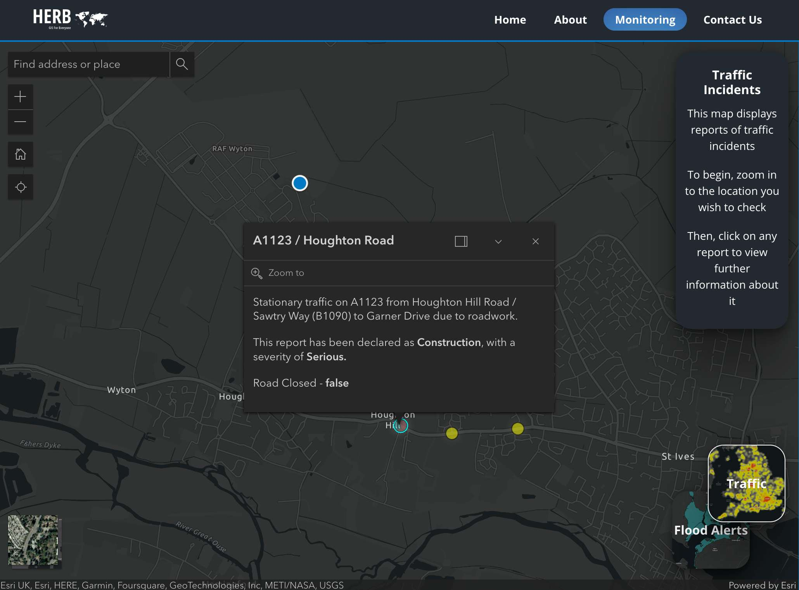
            

### Further Testing

- Family members and colleagues were consulted to receive feedback on the overall design and functionality of the website.
- Each link was tested on every individual page in order to ensure correct internal connection, as well as any external links.

### Known Bugs

- Sometimes the browser window may refresh when changing map faces. This is due to a large amount of data transfer possibly resulting in a memory overload for the specific browser tab.

## Site Deployment

The project was hosted using GitHub pages. This was done using the following process.

- Locating the [Settings](https://github.com/Natte2110/herb-monitoring/settings) Pane within the [GitHub Repository](https://github.com/Natte2110/herb-monitoring).
- Under the [Pages](https://github.com/Natte2110/herb-monitoring/settings/pages) section, the 'Main' branch was selected from the drop down within the 'Build And Deployment' sub-section.
- After a short wait, the [URL](https://natte2110.github.io/herb-monitoring/) was generated for the live project.

## Credits

### Content

The content (text within the information and about divs) used within the website was adapted from results that were generated using [ChatGPT](https://chat.openai.com/) using prompts such as:

- "Write me an about section for a website called HERB Monitoring which provides the ability to interact with geospatial API's"
- "Generate a slogan for this company based off the previous prompt".

### Media

The images used within the website were taken from [ESRI](https://www.esri.com/en-us/home) web pages and screenshots from maps previously made by myself.

[Coolers](https://coolors.co/) Was used in order to find a suitable colour scheme for the websites colour scheme as it provides valuable insights and allows you to view the colours as someone with different type of colour blindness would.

### Code

- The CSS to keep the background image fixed in place was taken from this [Stack Overflow](https://stackoverflow.com/questions/22006587/how-to-make-div-background-image-responsive) post.
- This [W3Schools Page](https://www.w3schools.com/cssref/pr_background-position.php) was used to understand the **background-position** CSS Rule used when repositioning the background images on smaller screens.
- Again, this [W3Schools Page](https://www.w3schools.com/howto/howto_css_blurred_background.asp) was used to understand how to blur the background image using CSS so that is does not distract from the foreground information.
- In order to dynamically blur the background image based on the pages scroll location, this [Mozilla Developer](https://developer.mozilla.org/en-US/docs/Web/API/Document/scroll_event) page was utilised to further understand the windows.onscroll event.
- The [Bootstrap](https://getbootstrap.com/docs/4.3/getting-started/introduction/) documentation was also consulted regularly to understand the grid/layout system and the available bootstrap components. It was also used to help enable the website to be responsive and available to all devices.
- This [Stack Overflow Page](https://stackoverflow.com/questions/59675724/how-do-i-test-an-onscroll-event-with-jest-enzyme-reactjs) was consulted in order to find out how to send a scroll event to a mock DOM within Jest testing environments.

## Further Development

Some future considerations or further development ideas are:

- Incorporate more pages for monitoring so people can interact with more API's.
- Add more interactivity to the data such as sharing or drawing custom shapes to highlight specific areas.
- Add functionality to print a chosen area of the map in order to share it with others.