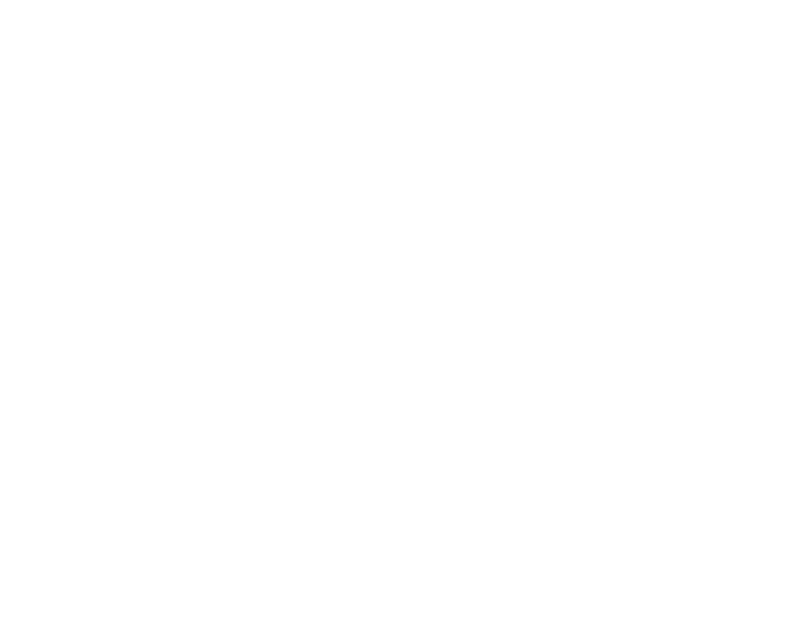

</img>

<h1 align="center">HERB Monitoring</h1>

Click [here]() to view the live project on GitHub Pages.

This is a project for the Code Institute Milestone Project 2. It is a website used to enable users to monitor frequently updated APIs containing geospatial information.

This will contain:
-   Weather Monitoring
-   Flood Alerts
-   Traffic Data

# User Experience (UX)

## User Stories

-    ### Goals For A First-Time Visitor:

        1. As A First Time Visitor - I want to be able to understand the main purpose of the site, and find out useful information regarding the business.
        2. As A First Time Visitor - I want to be able to view an intuitive layout and navigation to easily find the page I require.
        3. As A First Time Visitor - I want to be able to interact with the maps on the page to achieve my desired purpose.

-    #### Goals For A Returning Visitor:

        1. As A Returning Visitor - I want to be able to see any updates to the information on the monitoring maps.
        2. As A Returning Visitor - I want to be able to view a page containing contact details where I can ask for support or pose general queries.
        3. As A Returning Visitor - I want to be able to query the monitoring data to gain a better understanding of what it represents.

-    #### Goals For A Frequent Visitor:

        1. As A Frequent Visitor - I want to be able to view the sources of the data to verify it's integrity.
        2. As A Frequent Visitor - I want to be able to use a location feature to find a specific area of the country, preferably my own location.
        3. As A Frequent Visitor - I want to be able to draw my own features on the map in order to highliht a specific area.

## Design

-   ### Colour Scheme

    -   The main colour scheme will be an off-blue colour with an overall dark feel to the site. White text will be used atop this dark background to ensure clear visibility of all text across all pages.
    - This colour scheme will provide a professional feel to the website as well as being easily accessible to all users.

-   ### Typography

    -   The main font used within the websites design will be Open Sans, with a fall-back font of Sans-Serif if the Open Sans font could not be loaded. The Open Sans font gives off a professional first impression.

-   ### Imagery

    -   The home page will be fitted with a fixed, scrollable background image that will have a dynamic blur effect applied as the user scrolls.
    -   Imagery will also be available in [popups](https://developers.arcgis.com/javascript/latest/api-reference/esri-widgets-Popup.html) contained within the information displayed on the mapping pages.

## Wireframes

Click on the links below to access the wireframes created to plan and design this website.

-   [Desktop Home Page Wireframe](assets/media/desktop-wireframe01.png)

-   [Mobile Home Page Wireframe](assets/media/mobile-wireframe01.png)